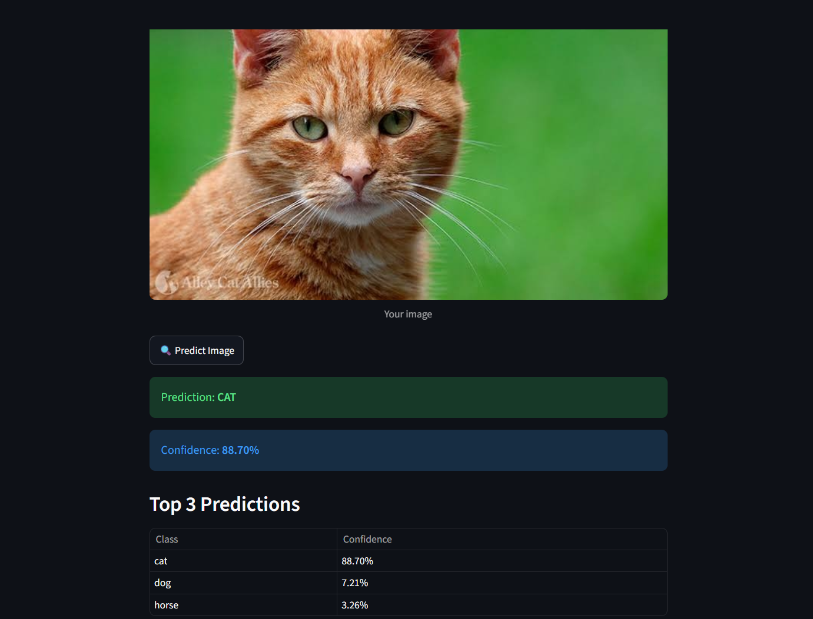

# 🖼️ CIFAR-10 Image Classification

An end-to-end deep learning project that classifies images into one of the 10 CIFAR-10 categories using a Convolutional Neural Network and a Streamlit web application.

## 📌 Project Overview

This project demonstrates the complete machine learning workflow:

- Data preparation and preprocessing
- Image classification model training
- Model evaluation
- Model saving
- Deployment through Streamlit
- Interactive image prediction

## 🎯 CIFAR-10 Classes

The model recognizes the following categories:

- Airplane
- Automobile
- Bird
- Cat
- Deer
- Dog
- Frog
- Horse
- Ship
- Truck

## 🛠️ Technologies Used

- Python
- TensorFlow / Keras
- NumPy
- Pandas
- Pillow
- Streamlit
- Google Colab

## 🧠 Model

The trained model is saved as:

```text
model.h5
```

The Streamlit application resizes uploaded images and processes them before making predictions.

## 🤗 Model Hosting

The trained model is hosted on Hugging Face:

[View Model on Hugging Face](https://huggingface.co/MedWassimAmira/cifar10-image-classifier-model)

The Streamlit application automatically downloads the model
from Hugging Face when it runs.

## 🌐 Streamlit Application

The application allows users to:

1. Upload an image.
2. Preview the uploaded image.
3. Predict its class.
4. Display the prediction confidence.
5. View the top 3 predictions.

## 🚀 How to Run the Project

### 1. Clone the repository

```bash
git clone https://github.com/MedWassimAmira/streamlit-image-classifier.git
cd CIFAR10_Project
```

### 2. Install dependencies

```bash
pip install -r requirements.txt
```

### 3. Run the Streamlit application

```bash
streamlit run streamlit_app.py
```

## 📊 Example Prediction

The Streamlit application was tested using a cat image.

### Prediction Results

| Metric            | Result        |
| ----------------- | ------------- |
| Predicted Class   | Cat 🐱        |
| Confidence        | 88.70%        |
| Second Prediction | Dog — 7.21%   |
| Third Prediction  | Horse — 3.26% |

### Application Screenshot



The application successfully identified the uploaded image as a cat with a confidence score of 88.70%.

## 📁 Project Structure

```text
CIFAR10_Project/
├── docs/
│   └── prediction_example.png
├── model.h5
├── streamlit_app.py
├── labels.txt
├── requirements.txt
└── README.md
```

## 👤 Author

**Mohamed Wassim Amira**

Business Intelligence Student | Aspiring Data Scientist

Interested in Data Science and Machine Learning.
